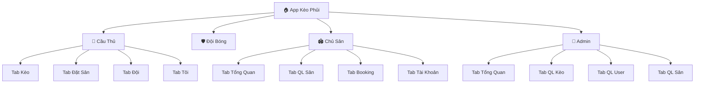
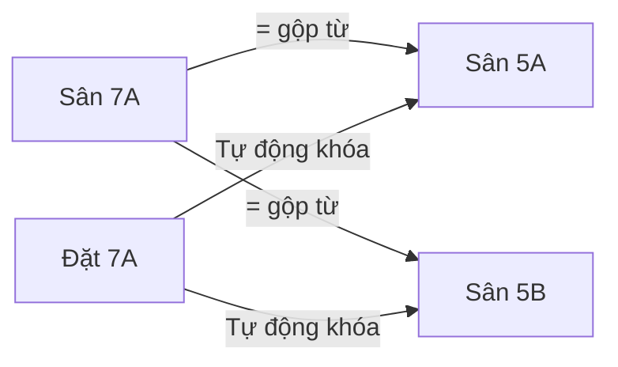
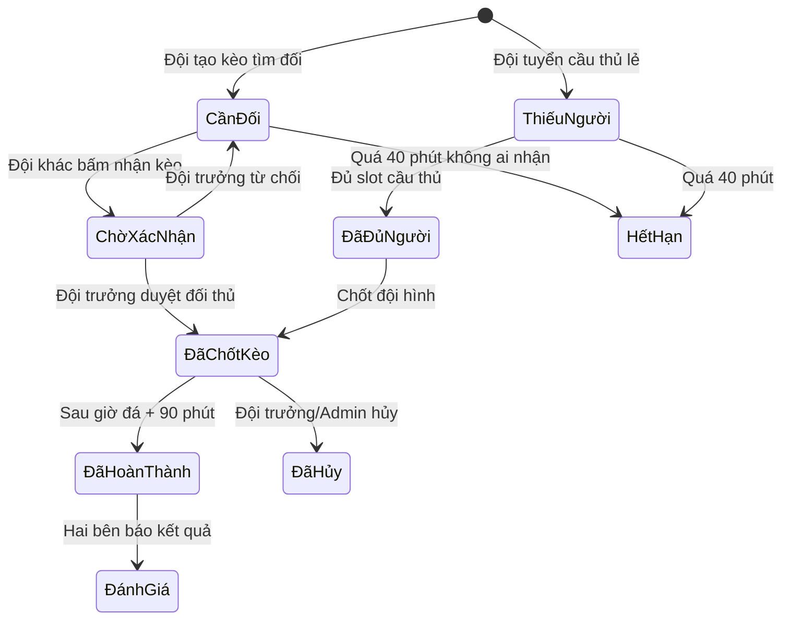

# 📱 BÁO CÁO TỔNG HỢP CHỨC NĂNG ỨNG DỤNG KÈO PHỦI

> **Phiên bản:** v1.0 — Ngày phân tích: 26/05/2026  
> **Tổng dung lượng code:** 9,640 dòng ([App.jsx](file:///Users/macbook/Documents/DEV%20TEST/app%20da%20banh/src/App.jsx))  
> **Lưu trữ dữ liệu:** localStorage (trình duyệt cục bộ)

---

## 🏗️ KIẾN TRÚC TỔNG QUAN

### Hệ thống chuyển đổi vai trò
- Ứng dụng hỗ trợ **3 chế độ**: `cầu thủ` → `chủ sân` → `admin`
- Một tài khoản có thể chuyển đổi qua lại giữa các chế độ mà không cần đăng xuất
- **Admin**: Yêu cầu tài khoản có role `super_admin`
- **Chủ sân**: Yêu cầu sân đã được Admin duyệt (`verification_status = 'verified'`)

---

## 👤 VAI TRÒ 1: CẦU THỦ (Người chơi cá nhân)

> *"Tôi là một người thích đá bóng, muốn tìm trận giao lưu hoặc tìm đội để đá chung."*

### 🔍 Tôi có thể KHÁM PHÁ gì?

| Chức năng | Mô tả chi tiết | Nút bấm |
|-----------|----------------|---------|
| **Xem Kèo Hot** (Tab Kèo) | Lướt bảng tin xem các trận đang tìm đối hoặc thiếu người. Có 3 bộ lọc nhanh: "Tìm đối" / "Thiếu người" / "Sân trống" | Bấm vào thẻ kèo để xem chi tiết |
| **Lọc kèo thông minh** | Lọc theo: Khu vực (Thủ Đức, Bình Thạnh, Q7, Gò Vấp), Thời gian (Hôm nay, Ngày mai, Cuối tuần, Ngày cụ thể), Loại sân (5/7/11) | Thanh lọc phía trên bảng tin |
| **Xem Sân Trống** (Tab Đặt Sân) | Duyệt danh sách khung giờ sân trống do chủ sân đăng, xem giá, vị trí, loại sân | Mỗi sân có nút "Tạo kèo từ slot này" |
| **Xem Đội Bóng** (Tab Đội) | Tìm kiếm đội bóng theo tên hoặc mã mời. Sắp xếp theo Rating / Tỷ lệ bùng kèo / Trình độ | Thanh tìm kiếm + bộ sắp xếp |
| **Ticker trực tiếp** | Thanh chạy chữ realtime hiển thị hoạt động mới nhất: TUYỂN CẦU, TÌM ĐỐI, CHỐT KÈO, KẾT THÚC | Tự động chạy trên Header |

### ⚡ Tôi có thể HÀNH ĐỘNG gì?

| Chức năng | Mô tả | Điều kiện |
|-----------|-------|-----------|
| **Đăng ký tham gia trận** | Xin vào đá chung đội đang thiếu người (gửi tên, SĐT, vị trí, ghi chú) | Trận phải có trạng thái "Thiếu người" |
| **Đăng ký dự bị** | Xin vào danh sách chờ nếu trận đã đủ người | Trận đã đủ slot nhưng chưa chốt |
| **Hủy yêu cầu** | Rút lại đăng ký tham gia/dự bị | Yêu cầu đang ở trạng thái "pending" |
| **Chấp nhận/Từ chối lời mời** | Khi đội trưởng mời tham gia trận | Có thông báo lời mời |
| **Tạo kèo từ sân trống** | Chọn một khung giờ trống → tạo trận tìm đối ngay trên sân đó | Phải là thành viên hoặc đội trưởng của 1 đội |
| **Đánh giá đối thủ** | Sau trận: chấm điểm đối thủ + báo kết quả (Thắng/Hòa/Thua/Bùng kèo) | Trận đã hoàn thành |
| **Khiếu nại đánh giá sai** | Báo cáo khi bị đối thủ đánh giá "Bùng kèo" sai sự thật | Trận có kết quả tranh chấp |

### 👤 Tôi có thể QUẢN LÝ gì về bản thân?

| Chức năng | Mô tả |
|-----------|-------|
| **Đăng ký / Đăng nhập** | 2 bước: Nhập SĐT (10 số) → Nhập tên hiển thị |
| **Đổi tên** | Thay đổi tên hiển thị (giới hạn 1 lần / 30 ngày) |
| **Xem hồ sơ cá nhân** | Hiển thị: Tên, SĐT, vai trò, điểm Fairplay/Uy tín |
| **Xem lịch sử trận** | Thống kê các trận đã tham gia/tạo trong 7 ngày gần nhất (chỉ trận hoàn thành) |
| **Xem thông báo** | Nhận tất cả thông báo liên quan: mời đội, duyệt/từ chối đăng ký, kết quả trận |
| **Đăng xuất** | Thoát tài khoản hiện tại |

---

## 🛡️ VAI TRÒ 2: ĐỘI BÓNG (Đội trưởng / Quản lý đội)

> *"Tôi đại diện một đội bóng phủi, muốn quản lý đội hình và tìm kiếm đối thủ."*

### 🏗️ Tôi có thể XÂY DỰNG ĐỘI gì?

| Chức năng | Mô tả |
|-----------|-------|
| **Tạo đội bóng mới** | Đặt tên đội, chọn khu vực, trình độ, khung giờ ưa thích, avatar đội |
| **Hệ thống mã mời** | Mỗi đội được tự động tạo mã mời (invite code) + link mời để chia sẻ cho bạn bè |
| **Gia nhập đội bằng mã** | Bất kỳ cầu thủ nào cũng có thể nhập mã mời để xin vào đội |
| **Duyệt thành viên** | Đội trưởng phê duyệt hoặc từ chối cầu thủ xin gia nhập |
| **Quản lý danh sách** | Xem toàn bộ thành viên: vai trò (owner/admin/member), trạng thái (joined/pending) |

### ⚔️ Tôi có thể TÌM KIẾM ĐỐI THỦ thế nào?

| Chức năng | Mô tả |
|-----------|-------|
| **Đăng kèo "Cần đối"** | Tạo trận từ slot sân trống: chọn đội mình, đặt trình độ yêu cầu, ghi chú thêm → Đăng lên bảng tin tìm đối thủ |
| **Đăng kèo "Thiếu người"** | Tuyển cầu thủ lẻ ghép vào đội: chọn số người cần, vị trí, sân, giờ đá → Đăng lên bảng tin |
| **Nhận kèo đối thủ** | Đại diện đội bấm "Nhận kèo" trên trận của đội khác → gửi yêu cầu ghép |
| **Mời giao hữu** | Chọn 1 đội bóng cụ thể → gửi lời mời đá giao hữu kèm slot sân |

### 📊 Tôi có thể QUẢN LÝ TRẬN thế nào?

| Chức năng | Mô tả | Điều kiện |
|-----------|-------|-----------|
| **Duyệt đối thủ** | Chấp nhận hoặc từ chối đội muốn nhận kèo của mình | Chế độ "Duyệt thủ công" |
| **Duyệt cầu thủ lẻ** | Chấp nhận / Từ chối / Cho vào danh sách chờ / Khôi phục cầu thủ đăng ký | Trận "Thiếu người" |
| **Điểm danh** | Đánh dấu "Đã có mặt" hoặc "Không tới" cho từng thành viên | Trận đã chốt kèo |
| **Sửa kèo** | Cập nhật: giờ đá, sân, giá, số người cần | Trước giờ đá ít nhất 60 phút |
| **Hủy trận** | Hủy toàn bộ trận đấu, thông báo tự động gửi đến tất cả người liên quan | Bất kỳ lúc nào trước khi trận hoàn thành |

---

## 🏟️ VAI TRÒ 3: CHỦ SÂN (Quản lý cụm sân bóng)

> *"Tôi kinh doanh sân bóng, muốn số hóa quá trình quản lý booking và tìm khách."*

### 📝 Tôi cần ĐĂNG KÝ thế nào?

| Bước | Mô tả |
|------|-------|
| **1. Đăng ký làm Chủ sân** | Nhập: Tên sân, Quận/Huyện, SĐT sân, Địa chỉ, Số lượng sân (5/7/11), Ghi chú |
| **2. Chờ Admin duyệt** | Hồ sơ gửi lên Admin để xác minh, trạng thái = `pending` |
| **3. Được duyệt** | Admin bấm duyệt → `verification_status = 'verified'` → mở khóa toàn bộ tính năng Chủ sân |

### 📅 Tôi có thể ĐĂNG BÀI gì? (Tab Booking — 3 nút chính)

| Nút | Biểu tượng | Mô tả | Kết quả |
|-----|-----------|-------|---------|
| **Đăng Sân Trống** | 🏟️ | Đăng khung giờ chưa có ai thuê lên bảng tin công khai để cầu thủ/đội bóng tự vào xem và đặt | Slot xuất hiện ở Tab "Đặt Sân" của cầu thủ, trạng thái = **Trống** |
| **Đăng Tìm Đối** | 🔥 | Tạo trận hộ khách hàng (khách nhờ chủ sân tìm đối thủ giùm). Nhập tên đội khách, SĐT, trình độ | Trận xuất hiện ở Tab "Kèo" bảng tin, trạng thái = **Chờ ghép đội** |
| **Khách Đã Đặt** | 💼 | Ghi nhận khách gọi tới đặt trọn sân (không cần tìm đối). Nhập tên khách, SĐT, khung giờ, giá | Slot chốt cứng luôn, **KHÔNG** hiện trên bảng tin kèo, trạng thái = **Đã chốt** |

### 📊 Tôi có thể QUẢN LÝ SÂN thế nào? (Tab QL Sân — Control Center)

| Chức năng | Mô tả |
|-----------|-------|
| **Bảng thống kê tổng quan** | 3 ô số liệu realtime: Trống / Đã chốt / Chờ ghép đội |
| **Lọc theo loại sân** | Tất cả / Sân 5 / Sân 7 / Sân 11 |
| **Lọc theo thời gian** | Hôm nay / Ngày mai / Ngày cụ thể |
| **Lọc theo trạng thái** | Tất cả / Trống / Chờ ghép đội / Đã chốt |
| **Hiển thị Grid trực quan** | Các sân (5A, 5B, 7A...) hiện dạng thẻ card, mỗi slot khung giờ có chấm màu: 🟢 Trống, 🔵 Chờ ghép, 🔴 Đã chốt |
| **Bấm vào slot** | Mở popup thao tác: Sửa giá / Sửa ghi chú / Hủy-Xóa |
| **Cài đặt sân** | Cấu hình: Tên sân, SĐT, Số lượng sân từng loại, Quy tắc tách/gộp sân (VD: 7A = 5A + 5B) |

### 🔗 Hệ thống Ghép Sân tự động

- Chủ sân tự cấu hình quy tắc: VD "Sân 7A = Sân 5A + Sân 5B"
- Khi có người đặt Sân 7A → hệ thống **tự động khóa** Sân 5A và 5B cùng khung giờ đó
- Ngăn chặn tình trạng đặt trùng sân

### 📬 Tôi nhận được THÔNG BÁO gì?

- ✅ Có đội nhận kèo trên sân của tôi
- ✅ Có khách đặt sân
- ✅ Ghép đội thành công
- ✅ Có đội/khách hủy kèo
- ✅ Trận đấu đã hoàn thành

---

## 👑 VAI TRÒ 4: ADMIN (Người tạo App — Quản trị hệ thống)

> *"Tôi là người vận hành nền tảng, cần giám sát và quản lý mọi hoạt động."*

### 📊 Tab Tổng Quan — Dashboard

| Chỉ số | Mô tả |
|--------|-------|
| **Tổng người dùng** | Số lượng tài khoản đã đăng ký |
| **Tổng sân bóng** | Số cụm sân đang hoạt động trên hệ thống |
| **Tổng trận đấu** | Số trận đã được tạo ra (tất cả trạng thái) |
| **Doanh thu ước tính** | Tổng giá trị các trận đã chốt thành công |

### 🎮 Tab QL Kèo — Quản lý toàn bộ trận đấu

| Chức năng | Mô tả |
|-----------|-------|
| **Xem tất cả trận** | Danh sách toàn bộ trận đấu trên hệ thống, bất kể ai tạo |
| **Hủy trận bất kỳ** | Quyền Admin override — hủy bất kỳ trận nào nếu có tranh chấp/vi phạm |

### 👥 Tab QL User — Quản lý người dùng

| Sub-tab | Chức năng |
|---------|-----------|
| **Lịch sử** | Xem lịch sử trận đấu của tất cả người dùng |
| **Quản lý** | Xem/chỉnh sửa hồ sơ người dùng, reset dữ liệu |
| **Chủ sân** | Danh sách tài khoản đã đăng ký làm Chủ sân |

### 🏟️ Tab QL Sân — Duyệt đối tác

| Chức năng | Mô tả |
|-----------|-------|
| **Duyệt hồ sơ sân** | Xem thông tin đăng ký sân mới, bấm **Duyệt** (verified) hoặc **Từ chối** |
| **Khóa/Gỡ quyền** | Thu hồi quyền Chủ sân nếu phát hiện vi phạm |

---

## 🔄 VÒNG ĐỜI TRẬN ĐẤU (Match Lifecycle)

### Các trạng thái trận đấu

| Trạng thái | Ý nghĩa | Màu hiển thị |
|------------|---------|--------------|
| **Cần đối** | Đang tìm đối thủ | 🟡 Vàng |
| **Thiếu người** | Đang tuyển cầu thủ lẻ | 🟠 Cam |
| **Đang chờ xác nhận** | Có đội xin nhận kèo, chờ duyệt | 🔵 Xanh dương |
| **Đã chốt kèo** | Hai đội đã chốt, có mã booking | 🟢 Xanh lá |
| **Đã hoàn thành** | Trận đã kết thúc | ⚪ Xám |
| **Đã hủy** | Bị hủy bởi đội trưởng hoặc Admin | 🔴 Đỏ |
| **Hết hạn** | Tự động hủy sau 40 phút không ai nhận | ⚫ Đen |

---

## 🔔 HỆ THỐNG THÔNG BÁO

Hệ thống có **30+ loại thông báo** tự động, được phân phối đến đúng người nhận:

| Sự kiện | Ai nhận? |
|---------|---------|
| Trận mới được tạo | Cầu thủ trong khu vực |
| Có người xin nhận kèo | Đội trưởng tạo kèo |
| Yêu cầu được duyệt/từ chối | Người xin tham gia |
| Trận đã chốt thành công | Tất cả thành viên 2 đội |
| Trận bị hủy | Tất cả người liên quan |
| Trận hết hạn (40 phút) | Đội trưởng tạo kèo |
| Trận hoàn thành | Tất cả thành viên |
| Kết quả trận (thắng/thua/hòa) | 2 đội |
| Điểm danh: có mặt/vắng | Người được điểm danh |
| Đăng ký sân được duyệt/từ chối | Chủ sân đăng ký |
| Lời mời giao hữu | Đội trưởng đội được mời |
| Yêu cầu gia nhập đội | Đội trưởng |
| Đổi tên thành công | Người đổi tên |

---

## 💾 CẤU TRÚC DỮ LIỆU

| Kho dữ liệu | Key localStorage | Nội dung |
|-------------|-----------------|---------|
| **users** | `keophui_users` | Danh sách tất cả tài khoản (tên, SĐT, avatar, roles, fairplay) |
| **venues** | `keophui_venues` | Danh sách sân bóng (tên, địa chỉ, capacities, combinations, trạng thái duyệt) |
| **matches** | `keophui_matches` | Tất cả trận đấu (2 đội, giờ, sân, giá, trạng thái, danh sách cầu thủ) |
| **slots** | `keophui_slots` | Khung giờ sân (giờ, ngày, loại sân, giá, trạng thái) |
| **teams** | `keophui_teams` | Đội bóng (tên, thành viên, mã mời, thống kê win/lose) |
| **notifications** | `keophui_global_notifications` | Tất cả thông báo hệ thống |
| **user** | `keophui_user` | Tài khoản đang đăng nhập |
| **pitchOwners** | `keophui_pitchOwners` | Danh sách SĐT chủ sân |

---

## 📈 TỔNG KẾT SỐ LIỆU

| Hạng mục | Số lượng |
|----------|---------|
| **Tổng số Tab** | 12 tab (4 Player + 4 Owner + 4 Admin) |
| **Tổng số Modal/Form** | 16 loại modal |
| **Tổng số Form Handler** | 13 hàm xử lý |
| **Tổng số State Variable** | ~45 biến trạng thái |
| **Tổng số Notification Type** | 30+ loại thông báo |
| **Tổng số Card Component** | 5 loại thẻ hiển thị |
| **Trạng thái trận đấu** | 7 trạng thái |

> [!IMPORTANT]
> Toàn bộ dữ liệu hiện đang lưu trên **localStorage** (trình duyệt cục bộ). Nếu muốn triển khai thực tế với nhiều người dùng, cần nâng cấp lên Backend + Database thực (Firebase, MongoDB, PostgreSQL...).
